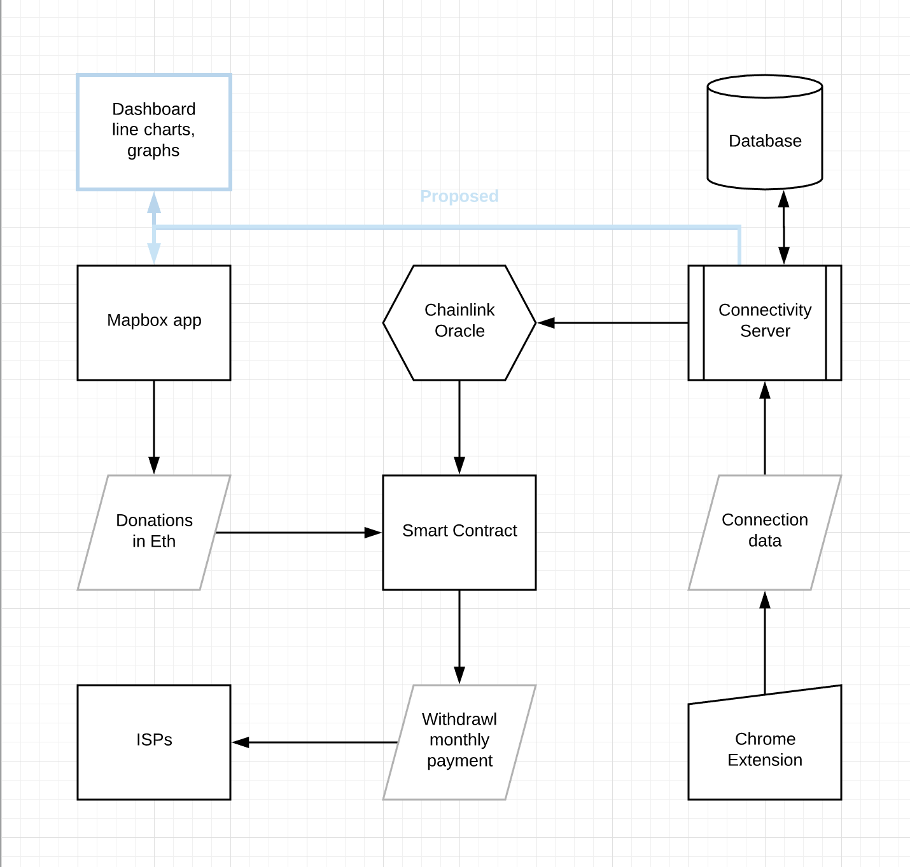

# Unicef Internet Service Provider monitoring - Blocksolid

This project is a proof of concept build at the EthNewYork2019 hackathon to address the [issues presented by Unicef](https://github.com/unicef-isp-manager/eth-new-york-2019/wiki/Bounty---project-inspiration).

This project allows people to donate Eth to specific countries to pay for internet service to schools. It monitors the connectivity of each school with a chrome extension that needs to be installed on each computer at the school. The data collected from the extension gets sent to a server. This data is then used to determine if the internet service provider (ISP) is performing above threshold or not. This data gets sent to the smart contract through a Chainlink oracle and gets used to allow the ISP to call the withdraw function. The data in the server is also served through an API to one or more front ends.

The magicbox-app is the front end. In the corner is the donation component. When a country on the map is selected it grabs the name. That gets sent along with the donation amount (in Eth) to the smart contract. 

The smart contract, DonationsManager, is in the chainlink folder. It extends Ownable,  allowing only owners to call certain functions. It holds all of the donations, currently organized by country. ISPs and their monthly fees are entered by the owners. Currently deployed on Rinkeby at 0xaf5849d6454bfd00820bfa6c645120efad7a5fd1

The chrome extension downloads an image of known size, measures the time to complete, and reports that to the server at regular interval. The icon in the tray changes color based on the speed data.

The server collects the data from the chrome extension, determines if the threshold was met, and serves an endpoint for the Chainlink oracle to call.  

This project is a proof of concept build at the EthNewYork hackathon. 

## Installation 

`git clone https://github.com/unicef-isp-manager/eth-new-york-2019.git`

each folder contains a README with instructions for running locally

## Discussion

The telegram channel for the project is [Telegram: Contact @Blocksolid](https://t.me/Blocksolid)
