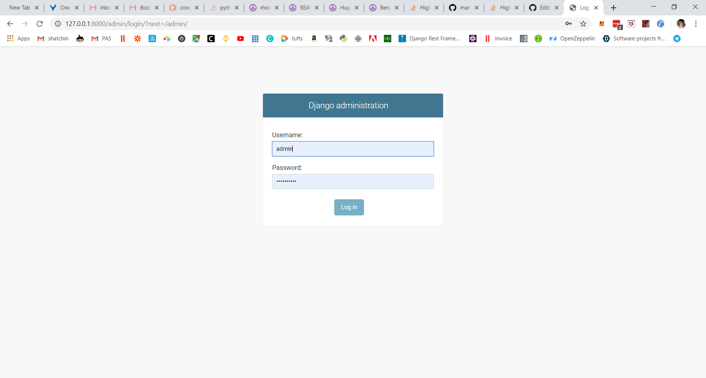
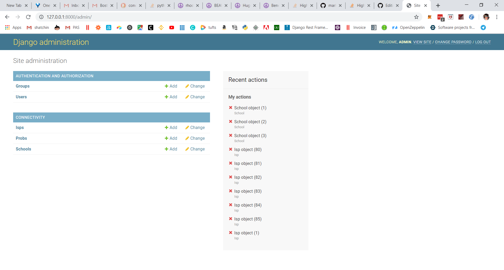

1. Install python 3.7 follow instructions [here](https://realpython.com/installing-python/)

2. Install django and djangorestframework packages:
```console
> pip install django
> pip install djangorestframework
> pip install sqlparse
> cd server-django\\unicef
> python manage.py runserver
```

3. Open browser and type 127.0.0.1:8000/admin in the address bar:

Username: admin
Password: admin-pass
Super user may add, edit or delete schools or isp:


##Additional commands
To change admin password:
```console
python manage.py changepassword admin
```
To create additional super user
```console
python manage.py createsuperuser
```
