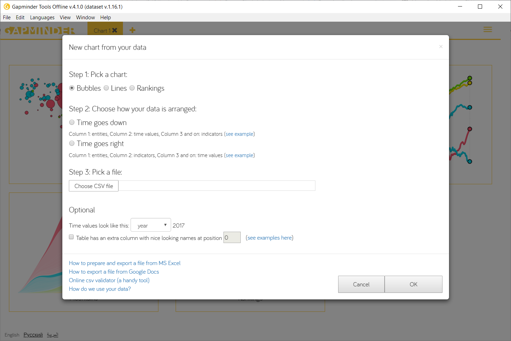

# Data visualization guide

### Download gapminder [here](https://www.gapminder.org/tools-offline)

## Internet users by countries:
* File :arrow_forward: New chart :arrow_forward: Gapminder data 
* Chart type - maps
* Color - internet users (move year handle to 2000-1017 no data outside of this timeframe)
* Size - population
## Donations vs connected schools:
File :arrow_forward: New chart :arrow_forward: your data :arrow_forward: CSV file 

**Step 1:** Pick a chart: Bubbles

**Step 2:** Choose how your data is arranged: Time goes right

**Step 3:** Pick a file: *Congo provinces.csv*

**Optional:** Time values look like this: choose year from the dropdown menu

- Y: connected schools (%)
- X: donations (ETH)
- Color: bandwidth
- Size: population
## Two schools in Kinshasa:
File :arrow_forward: New chart :arrow_forward: your data :arrow_forward: CSV file

**Step 1:** Pick a chart:  Lines

**Step 2:** Choose how your data is arranged: Time goes down

**Step 3:** Pick a file: *Lycee Mpiko connectivity report.csv*

**Optional:** Time values look like this: choose day from the dropdown menu

- Color: school
## ISP performance vs donations:
File :arrow_forward: New chart :arrow_forward: your data :arrow_forward: CSV file

**Step 1:** Pick a chart - bubbles

**Step 2:** Choose how your data is arranged: Time goes down

**Step 3:** Pick a file: *ISP data.csv*

**Optional:** Time values look like this: choose year from the dropdown menu

- Y: Data provided (Tbits)
- X: Connected schools
- Color: Internet service provider
- Size: Payment withdrawn
